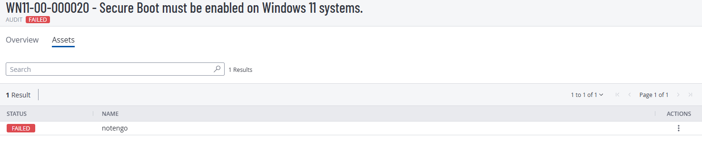

# WN11-00-000020  
## Secure Boot Must Be Enabled on Windows 11 Systems

**STIG ID:** WN11-00-000020  
**Severity:** High  
**System:** Windows 11 (Azure Virtual Machine)  
**Asset:** notengo  
**Assessment Tool:** Tenable / STIG Viewer  
**Assessment Date:** 02/01/2026  
**Analyst:** Maury Nickelson  

---

## Table of Contents

- [Skills Demonstrated](#skills-demonstrated)
- [Control Objective](#control-objective)
- [Security Risk](#security-risk)
- [Technical Background](#technical-background)
- [Phase 1 — Detection (Baseline Scan)](#phase-1--detection-baseline-scan)
- [Phase 2 — Validation & Analysis](#phase-2--validation--analysis)
- [Remediation Decision](#remediation-decision)
- [Platform Limitation & Risk Acceptance](#platform-limitation--risk-acceptance)
- [Recommended Remediation](#recommended-remediation)
- [Evidence](#evidence)
- [NIST 800-53 Mapping](#nist-800-53-mapping)
- [Security Impact Assessment](#security-impact-assessment)

---

## Skills Demonstrated

- High-severity vulnerability assessment and remediation planning  
- Secure Boot validation using PowerShell (`Confirm-SecureBootUEFI`)  
- UEFI vs Legacy BIOS architecture analysis  
- GPT vs MBR disk configuration validation  
- Cloud infrastructure security assessment (Azure VM architecture)  
- Vulnerability scanner result validation and true-positive confirmation  
- Platform constraint analysis and risk acceptance documentation  
- Compensating control identification and security gap analysis  
- Security baseline alignment with DISA STIG requirements  
- Security reporting and audit artifact documentation  

---

## Control Objective

Ensure Secure Boot is enabled to enforce hardware-based trust validation during system startup.

Secure Boot:

- Prevents execution of unauthorized bootloaders  
- Protects against rootkits and bootkits  
- Enforces firmware integrity  
- Supports Zero Trust principles at boot time  

---

## Security Risk

Without Secure Boot enabled:

- Malicious bootloaders may execute before OS-level security controls  
- EDR and antivirus protections may be bypassed  
- System integrity monitoring can be disabled at startup  
- Persistent compromise may go undetected  

Severity: **High**

This control protects the system at the earliest stage of execution and is critical for platform integrity.

---

## Technical Background

Secure Boot requires:

- UEFI firmware  
- GPT partition style  
- Platform-level Secure Boot support  

Primary validation command:

```powershell
Confirm-SecureBootUEFI
```

Disk validation:

```powershell
Get-Disk | Select Number, IsBoot, IsSystem, PartitionStyle
```

---

# Phase 1 — Detection (Baseline Scan)

Initial Tenable STIG audit marked this control as **Failed**.

Secure Boot was not enabled.

### Baseline Audit Evidence



---

# Phase 2 — Validation & Analysis

## Secure Boot Status Validation

```powershell
Confirm-SecureBootUEFI
```

### Secure Boot Status Evidence


Result:

```
False
```

This confirmed the scanner finding was a **true positive**.

---

## Disk & Boot Architecture Validation

To confirm Secure Boot eligibility:

```powershell
Get-Disk | Select Number, IsBoot, IsSystem, PartitionStyle
```

### Disk Partition Validation Evidence


Result confirmed:

- PartitionStyle = GPT  
- System boots using UEFI  

This verifies Secure Boot is technically supported by the OS configuration.

---

# Remediation Decision

Secure Boot should be enabled because:

- System uses UEFI  
- Disk is GPT  
- No legacy dependency constraints exist  

However, remediation could not be executed due to Azure platform limitations.

---

# Platform Limitation & Risk Acceptance

The affected system is an Azure Virtual Machine.

In Azure:

- Secure Boot must be enabled at VM creation  
- Requires Generation 2 VM  
- Requires Trusted Launch enabled  
- Cannot be enabled post-deployment  

Validation confirmed that Secure Boot cannot be activated on the existing VM.

Because this control is infrastructure-level and cannot be modified from within the guest OS, remediation was classified as:

**Accepted Risk – Platform Limitation**

---

## Compensating Controls

The system remains protected through:

- Azure Network Security Groups (NSGs)  
- Endpoint Detection & Response (EDR)  
- Disk encryption  
- Restricted administrative access  
- Controlled inbound traffic policies  

These controls reduce risk exposure until VM redeployment.

---

# Recommended Remediation

To fully remediate:

1. Redeploy VM as Generation 2  
2. Enable Azure Trusted Launch  
3. Enable Secure Boot during VM creation  

Post-deployment validation:

```powershell
Confirm-SecureBootUEFI
```

Expected result:

```
True
```

---

# Evidence

Artifacts stored in `/evidence`:

- `WN11-00-000020_Baseline_Failed_Audit.png`
- `WN11-00-000020_SecureBoot_Status_Check.png`
- `WN11-00-000020_Disk_Partition_Validation.png`

---

# NIST 800-53 Mapping

| NIST Control | Control Name | Relevance |
|--------------|-------------|-----------|
| SI-7 | Software, Firmware, and Information Integrity | Protects boot-level integrity |
| CM-6 | Configuration Settings | Enforces secure boot configuration |
| SC-7 | Boundary Protection | Supports system trust at startup |
| IA-3 | Device Identification and Authentication | Validates trusted platform components |

---

# Security Impact Assessment

Although Secure Boot remains disabled due to Azure platform constraints, this assessment demonstrates:

- Accurate validation of high-severity scanner findings  
- Cloud security architecture awareness  
- Infrastructure boundary recognition (guest OS vs platform-level controls)  
- Proper risk acceptance documentation  
- Identification of compensating security controls  

This control requires infrastructure-level remediation and cannot be resolved solely within the operating system.
