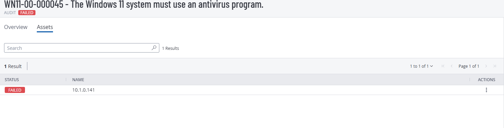
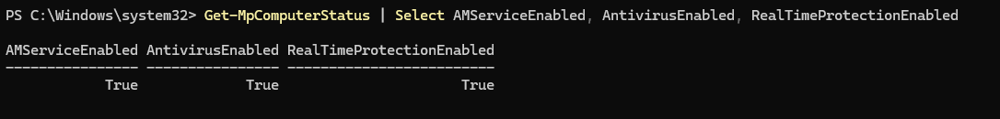
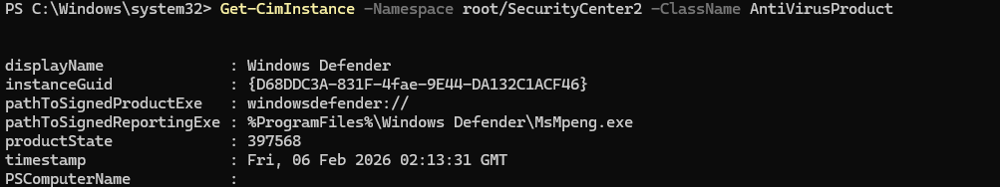

# WN11-00-000045  
## The Windows 11 System Must Use an Antivirus Program

**STIG ID:** WN11-00-000045  
**Severity:** High  
**System:** Windows 11  
**Asset:** notengo  
**Assessment Tool:** Tenable / STIG Viewer  
**Assessment Date:** 02/04/2026  
**Analyst:** Maury Nickelson  

---

## Table of Contents

- [Skills Demonstrated](#skills-demonstrated)
- [Control Objective](#control-objective)
- [Security Risk](#security-risk)
- [Technical Background](#technical-background)
- [Phase 1 — Detection (Baseline Scan)](#phase-1--detection-baseline-scan)
- [Phase 2 — Validation & Analysis](#phase-2--validation--analysis)
- [Remediation Decision](#remediation-decision)
- [Post-Validation Status](#post-validation-status)
- [Evidence](#evidence)
- [NIST 800-53 Mapping](#nist-800-53-mapping)
- [Compliance & Risk Assessment](#compliance--risk-assessment)

---

## Skills Demonstrated

- Endpoint security validation (Microsoft Defender Antivirus)  
- Malware protection verification and real-time protection analysis  
- PowerShell-based security status interrogation  
- Windows Defender service monitoring and configuration review  
- Windows Security Center (WSC) database querying via CIM/WMI  
- Vulnerability scanner result validation and false-positive analysis  
- High-severity control assessment and documentation  
- Security control verification aligned to STIG baselines  
- Operational escalation awareness for vulnerability management workflows  
- Windows endpoint protection troubleshooting  

---

## Control Objective

Ensure the Windows 11 system operates an active antivirus solution capable of:

- Detecting malicious software  
- Preventing malware execution  
- Providing real-time protection  

This control ensures endpoint protection is operational and aligned with federal hardening standards.

---

## Security Risk

Systems without active antivirus protection are exposed to:

- Malware infection  
- Credential theft  
- Persistence mechanisms  
- Remote code execution  
- Lateral movement  

Absence of antivirus protection significantly increases the likelihood of system compromise.

Severity: **High**

---

## Technical Background

Microsoft Defender Antivirus provides:

- Real-time protection  
- Behavior monitoring  
- Signature-based detection  
- Integration with Windows Security Center  

Primary validation command:

```powershell
Get-MpComputerStatus | Select AMServiceEnabled, AntivirusEnabled, RealTimeProtectionEnabled
```

Security Center validation command:

```powershell
Get-CimInstance -Namespace root/SecurityCenter2 -ClassName AntiVirusProduct
```

These commands confirm both operational status and OS-level recognition of antivirus protection.

---

# Phase 1 — Detection (Baseline Scan)

Initial Tenable STIG audit marked this control as **Failed**.

The scanner reported that no antivirus program was active on the system.

### Baseline Audit Evidence



---

# Phase 2 — Validation & Analysis

To determine whether the finding was legitimate or a scanner false positive, manual validation was performed.

## Defender Service Status Check

```powershell
Get-MpComputerStatus | Select AMServiceEnabled, AntivirusEnabled, RealTimeProtectionEnabled
```

### Result

- AMServiceEnabled: True  
- AntivirusEnabled: True  
- RealTimeProtectionEnabled: True  

### PowerShell Validation Evidence



This confirmed:

- Microsoft Defender service is running  
- Antivirus engine is enabled  
- Real-time protection is active  

---

## Windows Security Center Validation

```powershell
Get-CimInstance -Namespace root/SecurityCenter2 -ClassName AntiVirusProduct
```

### Security Center Evidence



Results confirmed:

- Windows recognizes Microsoft Defender as the installed antivirus solution  
- The system reports active protection  

These findings confirm the STIG requirement is satisfied.

---

# Remediation Decision

No remediation required.

Technical validation confirmed:

- Antivirus software is installed  
- Real-time protection is enabled  
- The OS reports active protection  

The Tenable finding was determined to be a **false positive**.

In an enterprise environment, this condition would be escalated to vulnerability management for scanner rule review.

---

# Post-Validation Status

Control determined compliant after manual validation.

No configuration changes were required.

Finding documented as scanner false positive.

---

# Evidence

Artifacts stored in `/evidence`:

- `WN11-00-000045_Baseline_Failed_Audit.png`
- `WN11-00-000045_Defender_Status_PowerShell.png`
- `WN11-00-000045_WindowsSecurityCenter_Query.png`

---

# NIST 800-53 Mapping

| NIST Control | Control Name | Relevance |
|--------------|-------------|-----------|
| SI-3 | Malicious Code Protection | Requires active malware detection capability |
| SI-2 | Flaw Remediation | Ensures protective software is maintained |
| CM-6 | Configuration Settings | Enforces secure baseline configuration |
| AC-6 | Least Privilege | Supports endpoint integrity controls |

---

# Compliance & Risk Assessment

Although the vulnerability scanner reported failure, manual validation confirmed:

- Microsoft Defender Antivirus is operational  
- Real-time protection is enabled  
- The system is actively protected against malware threats  

This assessment demonstrates:

- Mature vulnerability validation practices  
- Avoidance of unnecessary remediation  
- Strong understanding of endpoint security controls  
- Operational awareness of false-positive handling  

The control remains compliant.
