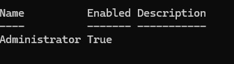
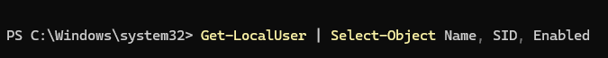
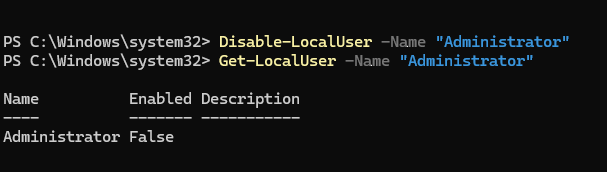

# WN11-00-000065  
## Unused Accounts Must Be Disabled or Removed From the System After 35 Days of Inactivity

**STIG ID:** WN11-00-000065  
**Severity:** Medium  
**System:** Windows 11 (Local Account Policy)  
**Impacted Asset:** notengo  
**Assessment Tool:** Tenable / STIG Viewer  
**Analyst:** Maury Nickelson  

---

## Table of Contents

- [Skills Demonstrated](#skills-demonstrated)
- [Control Objective](#control-objective)
- [Security Risk](#security-risk)
- [Phase 1 — Detection](#phase-1--detection)
- [Phase 2 — Validation & Analysis](#phase-2--validation--analysis)
- [Phase 3 — Remediation](#phase-3--remediation)
- [Phase 4 — Post-Remediation Validation](#phase-4--post-remediation-validation)
- [Evidence](#evidence)
- [NIST 800-53 Mapping](#nist-800-53-mapping)
- [Compliance Impact](#compliance-impact)

---

## Skills Demonstrated

- Windows 11 account lifecycle management  
- Local account enumeration using PowerShell  
- Inactive account detection and filtering logic  
- SID analysis for built-in vs manually created account identification  
- Identity & Access Management (IAM) control validation  
- Least privilege enforcement  
- Secure account disablement procedures  
- Vulnerability scanner finding validation  
- Root cause analysis of compliance warning conditions  
- STIG compliance documentation and audit artifact collection  

---

## Control Objective

Ensure unused local accounts are disabled or removed after 35 days of inactivity.

This control reduces exposure from dormant accounts that could be leveraged for:

- Unauthorized access  
- Privilege escalation  
- Lateral movement  
- Persistence  

---

## Security Risk

Inactive accounts increase attack surface because they:

- May retain valid credentials  
- Are less likely to be monitored  
- Can bypass normal operational oversight  
- Provide footholds for internal threat actors  

This control enforces proper Identity & Access Management (IAM) and supports least privilege principles.

---

# Phase 1 — Detection

Initial Tenable STIG audit identified the system as **Non-Compliant** due to enabled local accounts with no logon activity in over 35 days.

Identified account:

- Administrator  

---

# Phase 2 — Validation & Analysis

To confirm the finding was a true positive, I executed:

```powershell
Get-LocalUser |
Where-Object { $_.Enabled -eq $true -and $_.LastLogon -lt (Get-Date).AddDays(-35) }
```

### Pre-Remediation Evidence




Result:

- Administrator (Enabled = True)

The `LastLogon` value indicated no recent activity, confirming the account met the 35-day inactivity threshold.

This validated the scanner finding as a **true positive**.

---

## Account Identification & Risk Assessment

To determine whether the account was built-in or manually created:

```powershell
Get-LocalUser | Select-Object Name, SID, Enabled
```

### SID Validation Evidence



Findings:

- SID ended in **-1000**
- Built-in Administrator accounts end in **-500**

This confirmed:

- The account was not the built-in system Administrator  
- It was manually created  
- Disabling would not impact system-critical functionality  

This step ensured safe remediation.

---

# Phase 3 — Remediation

Rather than deleting the account, I chose to disable it to preserve auditability and potential recoverability.

Executed:

```powershell
Disable-LocalUser -Name "Administrator"
```

### Remediation Evidence



This action:

- Prevented authentication use
- Preserved forensic traceability
- Aligned with secure account governance practices

---

# Phase 4 — Post-Remediation Validation

To confirm successful remediation:

```powershell
Get-LocalUser -Name "Administrator"
```

### Post-Remediation Status Evidence


Verified:

- Enabled = False

A Tenable re-scan returned a **Warning** status rather than “Passed.”

This occurred due to the built-in Administrator account still being enabled, which may require additional policy configuration.

However, the manually created inactive account was successfully remediated.

---

## Evidence

Artifacts stored in `/evidence`:

- `WN11-00-000065_Pre_Remediation_Inactive_Account_Query.png`
- `WN11-00-000065_Pre_Remediation_Query_Result.png`
- `WN11-00-000065_SID_Validation.png`
- `WN11-00-000065_Remediation_Disable_Account.png`
- `WN11-00-000065_Post_Remediation_Account_Status.png`
- `WN11-00-000065_Baseline_Tenable_Report.pdf`
- `WN11-00-000065_Post_Remediation_Tenable_Report.pdf`

---

# NIST 800-53 Mapping

| NIST Control | Control Name | Relevance |
|--------------|-------------|-----------|
| AC-2 | Account Management | Governs account lifecycle and inactivity policies |
| AC-6 | Least Privilege | Restricts unnecessary account access |
| IA-2 | Identification & Authentication | Ensures only active authorized accounts are usable |
| IA-4 | Identifier Management | Controls account creation and maintenance |
| CM-6 | Configuration Settings | Enforces secure account configuration |

---

# Compliance Impact

This remediation:

- Reduced attack surface from dormant accounts  
- Strengthened local account governance  
- Enforced least privilege principles  
- Improved audit readiness  
- Demonstrated vulnerability validation discipline  
- Showed proper built-in vs custom account differentiation  

This lab highlights Identity & Access Management (IAM) enforcement within a Windows endpoint security context. 
