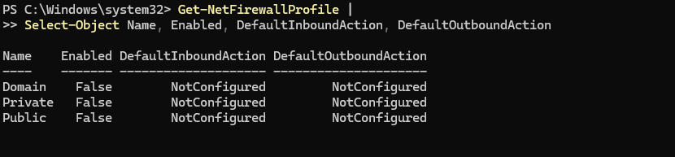

# WN11-00-000135  
## A Host-Based Firewall Must Be Installed and Enabled on the System

**STIG ID:** WN11-00-000135  
**Severity:** High  
**System:** Windows 11  
**Asset:** notengo  
**Assessment Tool:** Tenable / STIG Viewer  
**Assessment Date:** 02/01/2026  
**Analyst:** Maury Nickelson  

---

## Table of Contents

- [Skills Demonstrated](#skills-demonstrated)
- [Control Objective](#control-objective)
- [Security Risk](#security-risk)
- [Technical Background](#technical-background)
- [Phase 1 — Detection (Baseline Scan)](#phase-1--detection-baseline-scan)
- [Phase 2 — Validation & Analysis](#phase-2--validation--analysis)
- [Phase 3 — Remediation](#phase-3--remediation)
- [Phase 4 — Post-Remediation Validation](#phase-4--post-remediation-validation)
- [Operational Considerations (Scanner Access)](#operational-considerations-scanner-access)
- [Evidence](#evidence)
- [NIST 800-53 Mapping](#nist-800-53-mapping)
- [Compliance & Security Impact](#compliance--security-impact)

---

## Skills Demonstrated

- Windows Defender Firewall configuration  
- Firewall profile analysis (Domain / Private / Public)  
- PowerShell-based remediation  
- Network exposure reduction  
- Security vs operational balance  
- Vulnerability scanner troubleshooting  
- High-severity STIG remediation lifecycle  
- NIST 800-53 boundary protection alignment  

---

## Control Objective

Ensure a host-based firewall is installed and enabled on the system.

This control:

- Minimizes network exposure  
- Blocks unauthorized inbound connections  
- Reduces attack surface  
- Provides defense-in-depth  

---

## Security Risk

Without a host-based firewall:

- Any listening service becomes reachable  
- Malware lateral movement becomes easier  
- Remote exploitation risk increases  
- Boundary protection is weakened  

This is a **High severity** control due to direct network exposure impact.

---

## Technical Background

Windows Defender Firewall operates using three profiles:

- Domain  
- Private  
- Public  

Each profile must be enabled to ensure protection across network contexts.

PowerShell cmdlet used for validation:

```
Get-NetFirewallProfile
```

---

# Phase 1 — Detection (Baseline Scan)

Initial Tenable STIG audit marked this control as **Failed**.

### Baseline Audit Status


The system did not have Microsoft Defender Firewall enabled.

---

# Phase 2 — Validation & Analysis

To validate the scanner finding:

```powershell
Get-NetFirewallProfile |
Select-Object Name, Enabled, DefaultInboundAction, DefaultOutboundAction
```

### Validation Result (Pre-Remediation)

```
Enabled : False
```

Firewall was disabled across profiles.

### Pre-Remediation PowerShell Output



This confirmed the Tenable finding as a **true positive**.

---

# Phase 3 — Remediation

Remediation required enabling the host-based firewall.

## PowerShell Remediation (Used)

```powershell
Set-NetFirewallProfile -Profile Domain,Private,Public -Enabled True
```

This enabled firewall protection across all network profiles.

---

# Phase 4 — Post-Remediation Validation

Re-ran validation command:

```powershell
Get-NetFirewallProfile |
Select-Object Name, Enabled, DefaultInboundAction, DefaultOutboundAction
```

### Validation Result

```
Enabled : True
```

Firewall successfully enabled on:

- Domain
- Private
- Public

### Post-Remediation PowerShell Output


Tenable re-scan confirmed the control passed.

---

# Operational Considerations (Scanner Access)

After enabling the firewall:

Tenable was unable to scan the system due to default inbound blocking rules.

To validate remediation while maintaining security posture:

- A temporary inbound TCP rule was created
- Scope was limited to required profile
- Rule was controlled and minimally permissive

This demonstrated balancing security enforcement with operational scanning requirements.

---

# Evidence

Evidence stored in `/evidence` folder:

- `baseline_failed_audit.png`
- `pre_remediation_firewall_status.png`
- `post_remediation_firewall_status.png`

---

# NIST 800-53 Mapping

| NIST Control | Control Name | Relevance |
|--------------|-------------|-----------|
| SC-7 | Boundary Protection | Enforces network boundary restrictions |
| AC-4 | Information Flow Enforcement | Controls inbound/outbound network traffic |
| CM-6 | Configuration Settings | Enforces secure firewall configuration |
| AC-3 | Access Enforcement | Restricts unauthorized connections |
| SI-2 | Flaw Remediation | Addresses exposure vulnerability |

---

# Compliance & Security Impact

This remediation:

- Reduced system network exposure  
- Strengthened boundary protection  
- Enforced secure configuration standards  
- Demonstrated firewall policy management  
- Balanced security enforcement with scanner operational requirements  

This control directly improves defensive posture and reduces attack surface.
