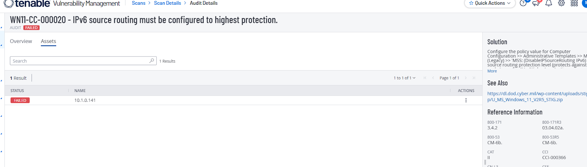
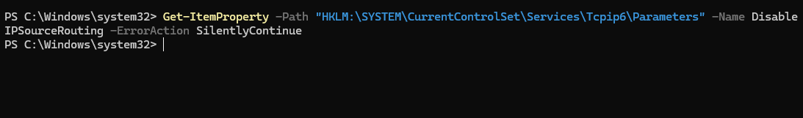
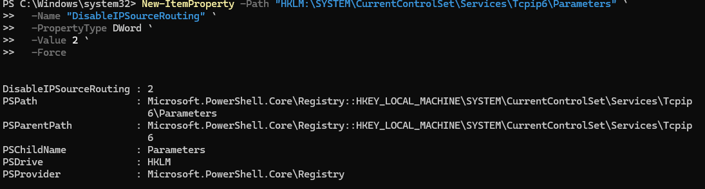
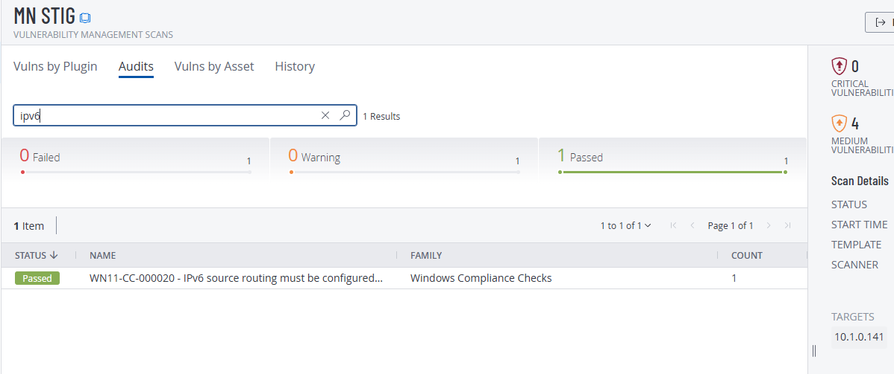

# WN11-CC-000020  
## IPv6 Source Routing Must Be Configured to Highest Protection

**STIG ID:** WN11-CC-000020  
**Severity:** Medium  
**System:** Windows 11  
**Asset:** notengo  
**Assessment Tool:** Tenable / STIG Viewer  
**Assessment Date:** 02/08/2026  
**Analyst:** Maury Nickelson  

---

## Table of Contents

- [Skills Demonstrated](#skills-demonstrated)
- [Control Objective](#control-objective)
- [Security Risk](#security-risk)
- [Technical Background](#technical-background)
- [Phase 1 — Detection (Baseline Scan)](#phase-1--detection-baseline-scan)
- [Phase 2 — Validation & Analysis](#phase-2--validation--analysis)
- [Phase 3 — Remediation](#phase-3--remediation)
- [Phase 4 — Post-Remediation Validation](#phase-4--post-remediation-validation)
- [Evidence](#evidence)
- [NIST 800-53 Mapping](#nist-800-53-mapping)
- [Compliance & Security Impact](#compliance--security-impact)

---

## Skills Demonstrated

- Windows network stack hardening and secure TCP/IP configuration  
- IPv6 security control enforcement and attack surface reduction  
- Registry-based security configuration auditing and modification  
- PowerShell-based registry interrogation and remediation  
- Vulnerability scanner result validation and true-positive confirmation  
- Medium-severity vulnerability remediation lifecycle execution  
- Network-layer security configuration management  
- Endpoint baseline alignment with DISA STIG requirements  
- Security documentation and audit artifact collection  

---

## Control Objective

Configure IPv6 source routing to the highest protection level by disabling it.

This control enforces system-level network hardening to prevent attackers from manipulating packet routing paths to bypass security monitoring, filtering controls, or detection mechanisms.

Required registry value:

```
DisableIPSourceRouting = 2
```

---

## Security Risk

If IPv6 source routing is enabled or not configured to highest protection:

- Attackers may manipulate routing paths  
- Security controls may be bypassed  
- Network reconnaissance may be facilitated  
- Lateral movement opportunities may increase  

Severity: **Medium**

Disabling IPv6 source routing reduces routing manipulation risk and strengthens network-layer defenses.

---

## Technical Background

Registry path:

```
HKLM:\SYSTEM\CurrentControlSet\Services\Tcpip6\Parameters
```

Registry value:

```
DisableIPSourceRouting
```

Value definitions:

- 0 = No protection  
- 1 = Medium protection  
- 2 = Highest protection (required)

---

# Phase 1 — Detection (Baseline Scan)

Initial Tenable STIG audit marked this control as **Failed**.

### Baseline Audit Evidence



The system was not configured to the required highest protection level.

---

# Phase 2 — Validation & Analysis

Manual validation was performed using PowerShell:

```powershell
Get-ItemProperty `
  -Path "HKLM:\SYSTEM\CurrentControlSet\Services\Tcpip6\Parameters" `
  -Name DisableIPSourceRouting `
  -ErrorAction SilentlyContinue
```

### Pre-Remediation Registry Evidence



Result indicated:

- Value missing  
  OR  
- Value not equal to `2`

This confirmed the Tenable finding was a **true positive**.

---

# Phase 3 — Remediation

Remediation required configuring the registry value to enforce highest protection.

Executed:

```powershell
New-ItemProperty `
  -Path "HKLM:\SYSTEM\CurrentControlSet\Services\Tcpip6\Parameters" `
  -Name "DisableIPSourceRouting" `
  -PropertyType DWord `
  -Value 2 `
  -Force
```

This ensured:

```
DisableIPSourceRouting = 2
```

System was rebooted to ensure configuration enforcement.

Policy refresh executed:

```powershell
gpupdate /force
```

---

# Phase 4 — Post-Remediation Validation

Registry configuration re-validated:

```powershell
Get-ItemProperty `
  -Path "HKLM:\SYSTEM\CurrentControlSet\Services\Tcpip6\Parameters" `
  -Name DisableIPSourceRouting
```

### Post-Remediation Registry Evidence



Result confirmed:

```
DisableIPSourceRouting : 2
```

Tenable re-scan confirmed compliance.

### Post-Remediation Audit Evidence



---

# Evidence

Artifacts stored in `/evidence`:

- `WN11-CC-000020_Baseline_Failed_Audit.png`
- `WN11-CC-000020_Pre_Remediation_Registry_Check.png`
- `WN11-CC-000020_Post_Remediation_Registry_Check.png`
- `WN11-CC-000020_Post_Remediation_Passed_Audit.png`

---

# NIST 800-53 Mapping

| NIST Control | Control Name | Relevance |
|--------------|-------------|-----------|
| SC-7 | Boundary Protection | Prevents routing manipulation attacks |
| CM-6 | Configuration Settings | Enforces secure network configuration |
| AC-4 | Information Flow Enforcement | Controls packet routing behavior |
| SI-2 | Flaw Remediation | Addresses configuration weaknesses |

---

# Compliance & Security Impact

This remediation:

- Eliminated IPv6 routing manipulation exposure  
- Strengthened TCP/IP security baseline  
- Reduced network-layer attack surface  
- Enforced secure configuration standards  
- Demonstrated structured vulnerability remediation lifecycle  

This control improves overall network security posture and mitigates routing-based evasion techniques.
