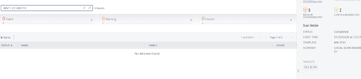

# WN11-CC-000110  
## Printing over HTTP Must Be Prevented

**STIG ID:** WN11-CC-000110  
**Severity:** Medium  
**System:** Windows 11  
**Asset:** notengo  
**Assessment Tool:** Tenable Vulnerability Management  
**Assessment Date:** 01/29/2026  
**Analyst:** Maury Nickelson  

---

## Table of Contents

- [Skills Demonstrated](#skills-demonstrated)
- [Control Objective](#control-objective)
- [Security Risk](#security-risk)
- [Technical Background](#technical-background)
- [Phase 1 — Detection (Baseline Scan)](#phase-1--detection-baseline-scan)
- [Phase 2 — Validation & Analysis](#phase-2--validation--analysis)
- [Phase 3 — Remediation](#phase-3--remediation)
- [Phase 4 — Post-Remediation Validation](#phase-4--post-remediation-validation)
- [Evidence](#evidence)
- [NIST 800-53 Mapping](#nist-800-53-mapping)
- [Compliance & Operational Impact](#compliance--operational-impact)

---

## Skills Demonstrated

- Windows 11 STIG remediation lifecycle execution  
- Registry-based policy validation via PowerShell  
- Print Spooler attack surface reduction  
- True-positive vulnerability confirmation  
- Secure configuration enforcement  
- Policy-based remediation  
- Vulnerability re-scan validation workflow  
- NIST 800-53 control alignment  
- Secure configuration documentation  

---

## Control Objective

Prevent printing over HTTP by enforcing the registry policy:

```
DisableHTTPPrinting = 1
```

This ensures HTTP-based print traffic is blocked and aligns the system with DISA STIG hardening requirements.

---

## Security Risk

Allowing HTTP printing increases exposure by:

- Expanding Print Spooler attack surface  
- Enabling remote exploitation pathways  
- Increasing risk of privilege escalation  
- Supporting lateral movement opportunities  

Given historical Print Spooler vulnerabilities (e.g., remote code execution flaws), disabling unnecessary communication channels is critical for system hardening.

---

## Technical Background

Windows HTTP printing allows clients to print to printers using web protocols.

Registry Path:

```
HKLM:\Software\Policies\Microsoft\Windows NT\Printers
```

Key:

```
DisableHTTPPrinting (DWORD)
```

Values:

- `0` = HTTP printing enabled (Non-Compliant)
- `1` = HTTP printing disabled (Compliant)

---

# Phase 1 — Detection (Baseline Scan)

Initial Tenable STIG audit marked this control as **Failed**.

### Baseline Audit Status


Full baseline report:

- [WN11-CC-000110_Baseline_Tenable_Report.pdf](evidence/WN11-CC-000110_Baseline_Tenable_Report.pdf)

---

# Phase 2 — Validation & Analysis

Before remediation, I validated the finding manually to confirm it was not a false positive.

Executed:

```powershell
Get-ItemProperty `
  -Path "HKLM:\Software\Policies\Microsoft\Windows NT\Printers" `
  -Name DisableHTTPPrinting `
  -ErrorAction SilentlyContinue
```

### Validation Result (Pre-Remediation)

```
DisableHTTPPrinting : 0
```

Value `0` confirms HTTP printing was enabled.

This validated the Tenable finding as a **true positive**.

---

# Phase 3 — Remediation

To enforce compliance, the policy was updated at the registry level.

Executed:

```powershell
Set-ItemProperty `
  -Path "HKLM:\Software\Policies\Microsoft\Windows NT\Printers" `
  -Name DisableHTTPPrinting `
  -Type DWord `
  -Value 1
```

Setting the value to `1` disables HTTP printing and aligns the system with STIG policy.

This change reduces unnecessary network exposure tied to the Print Spooler service.

---

# Phase 4 — Post-Remediation Validation

Validation performed using:

```powershell
Get-ItemProperty `
  -Path "HKLM:\Software\Policies\Microsoft\Windows NT\Printers" `
  -Name DisableHTTPPrinting
```

### Validation Result (Post-Remediation)

```
DisableHTTPPrinting : 1
```

HTTP printing successfully disabled.

Tenable re-scan confirmed compliance.

### Post-Remediation Audit Status



Full post-remediation report:

- [WN11-CC-000110_Post-Remediation_Tenable_Report.pdf](evidence/WN11-CC-000110_Post-Remediation_Tenable_Report.pdf)

---

# Evidence

Evidence stored in `/evidence` folder:

- Baseline screenshot: `baseline_failed_audit.png`
- Post-remediation screenshot: `post_remediation_passed.png`
- Baseline report: `WN11-CC-000110_Baseline_Tenable_Report.pdf`
- Post-remediation report: `WN11-CC-000110_Post-Remediation_Tenable_Report.pdf`

---

# NIST 800-53 Mapping

| NIST Control | Control Name | Relevance |
|--------------|-------------|-----------|
| CM-6 | Configuration Settings | Enforces secure system configuration |
| AC-3 | Access Enforcement | Restricts unintended communication channels |
| AC-6 | Least Privilege | Reduces unnecessary service exposure |
| SI-2 | Flaw Remediation | Addresses configuration weaknesses |
| SC-7 | Boundary Protection | Limits insecure network pathways |

---

# Compliance & Operational Impact

This remediation:

- Reduced Print Spooler attack surface  
- Eliminated unnecessary HTTP-based printing  
- Strengthened system hardening posture  
- Demonstrated registry-level policy enforcement  
- Validated compliance through vulnerability re-scan  
- Improved audit readiness  

This control aligns with enterprise hardening standards and demonstrates structured vulnerability remediation workflow.
