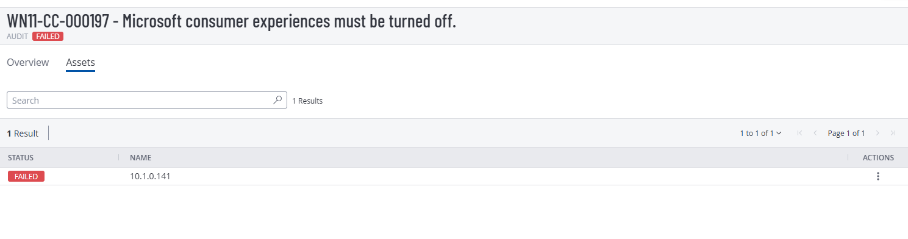
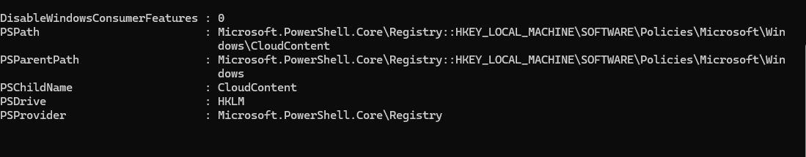
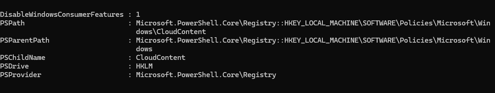
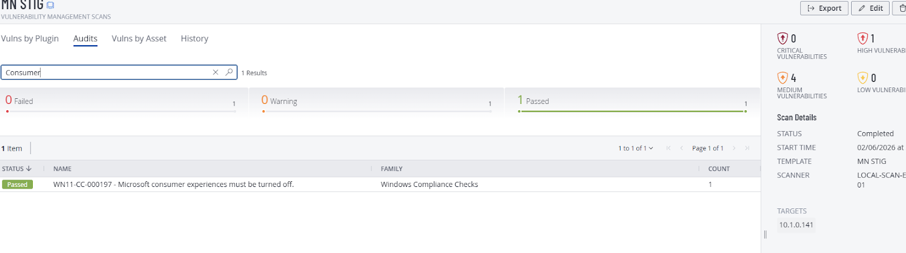

# WN11-CC-000197  
## Microsoft Consumer Experiences Must Be Turned Off

**STIG ID:** WN11-CC-000197  
**Severity:** Low  
**System:** Windows 11  
**Asset:** notengo  
**Assessment Tool:** Tenable / STIG Viewer  
**Assessment Date:** 02/06/2026  
**Analyst:** Maury Nickelson  

---

## Table of Contents

- [Skills Demonstrated](#skills-demonstrated)
- [Control Objective](#control-objective)
- [Security Risk](#security-risk)
- [Technical Background](#technical-background)
- [Phase 1 — Detection (Baseline Scan)](#phase-1--detection-baseline-scan)
- [Phase 2 — Validation & Analysis](#phase-2--validation--analysis)
- [Phase 3 — Remediation](#phase-3--remediation)
- [Phase 4 — Post-Remediation Validation](#phase-4--post-remediation-validation)
- [Evidence](#evidence)
- [NIST 800-53 Mapping](#nist-800-53-mapping)
- [Compliance & Security Impact](#compliance--security-impact)

---

## Skills Demonstrated

- Windows endpoint hardening and secure configuration management  
- Registry-level security policy enforcement and validation  
- PowerShell-based registry interrogation and configuration auditing  
- Group Policy security control verification  
- Vulnerability remediation lifecycle execution (detect → validate → remediate → verify)  
- Attack surface reduction through feature minimization  
- STIG baseline compliance alignment  
- Configuration drift identification and correction  
- Windows 11 operating system security control enforcement  
- Security documentation and audit evidence collection  

---

## Control Objective

Prevent Microsoft Consumer Experience features from being enabled on Windows 11 systems.

This control enforces a Group Policy setting that disables:

- Automatic installation of consumer applications  
- Unsolicited application suggestions  
- Consumer-facing system features  

The objective is to maintain a hardened, standardized enterprise configuration baseline.

---

## Security Risk

Although low severity, leaving Microsoft consumer experiences enabled may:

- Introduce unnecessary applications  
- Increase the system attack surface  
- Reduce configuration standardization  
- Install non-essential software components  

While not directly exploitable, disabling these features strengthens configuration hygiene and supports the principle of least functionality.

Severity: **Low**

---

## Technical Background

The Group Policy setting:

**Turn off Microsoft consumer experiences**

Is enforced via registry path:

```
HKLM:\SOFTWARE\Policies\Microsoft\Windows\CloudContent
```

Registry value:

```
DisableWindowsConsumerFeatures
```

Required value:

```
1
```

When set to `1`, consumer experience features are disabled at the operating system level.

---

# Phase 1 — Detection (Baseline Scan)

Initial Tenable STIG audit marked this control as **Failed**.

### Baseline Audit Evidence



The system did not have the required policy configured.

---

# Phase 2 — Validation & Analysis

Manual validation was performed to confirm the finding.

```powershell
Get-ItemProperty `
  -Path "HKLM:\SOFTWARE\Policies\Microsoft\Windows\CloudContent" `
  -Name DisableWindowsConsumerFeatures `
  -ErrorAction SilentlyContinue
```

### Pre-Remediation Registry Evidence



Result indicated:

- Policy not configured  
  OR  
- Value set to `0`

This confirmed the Tenable finding was a **true positive**.

---

# Phase 3 — Remediation

Remediation required enforcing the registry value associated with the Group Policy setting.

Executed:

```powershell
New-ItemProperty `
  -Path "HKLM:\SOFTWARE\Policies\Microsoft\Windows\CloudContent" `
  -Name "DisableWindowsConsumerFeatures" `
  -PropertyType DWord `
  -Value 1 `
  -Force
```

This sets:

```
DisableWindowsConsumerFeatures = 1
```

Which disables Microsoft consumer experience features at the OS level.

---

# Phase 4 — Post-Remediation Validation

Validation was performed using:

```powershell
Get-ItemProperty `
  -Path "HKLM:\SOFTWARE\Policies\Microsoft\Windows\CloudContent" `
  -Name DisableWindowsConsumerFeatures
```

### Post-Remediation Registry Evidence



Result confirmed:

```
DisableWindowsConsumerFeatures : 1
```

A Tenable re-scan confirmed the control passed.

### Post-Remediation Audit Evidence



---

# Evidence

Artifacts stored in `/evidence`:

- `WN11-CC-000197_Baseline_Failed_Audit.png`
- `WN11-CC-000197_Pre_Remediation_Registry_Check.png`
- `WN11-CC-000197_Post_Remediation_Registry_Check.png`
- `WN11-CC-000197_Post_Remediation_Passed_Audit.png`

---

# NIST 800-53 Mapping

| NIST Control | Control Name | Relevance |
|--------------|-------------|-----------|
| CM-6 | Configuration Settings | Enforces secure configuration baseline |
| CM-7 | Least Functionality | Reduces unnecessary features and services |
| AC-6 | Least Privilege | Supports minimal exposure of system components |
| SI-2 | Flaw Remediation | Addresses configuration weakness |

---

# Compliance & Security Impact

This remediation:

- Reduced unnecessary feature exposure  
- Strengthened Windows configuration baseline  
- Enforced Group Policy via registry control  
- Demonstrated structured remediation lifecycle  
- Validated compliance through scanner confirmation  

Although low severity, this control supports a hardened and standardized Windows 11 environment aligned with enterprise security best practices.
