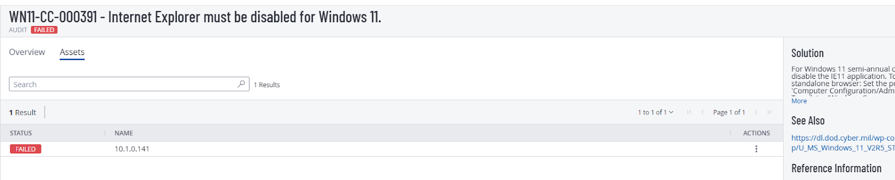
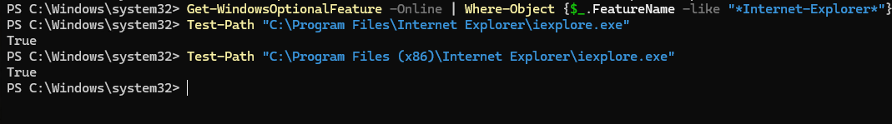
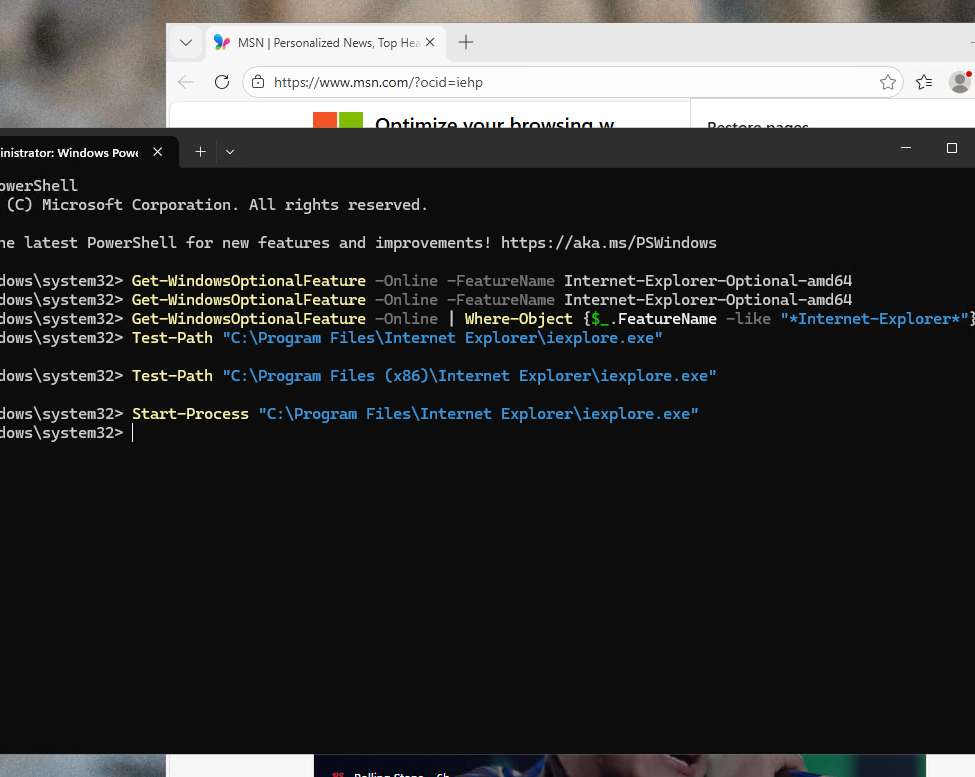
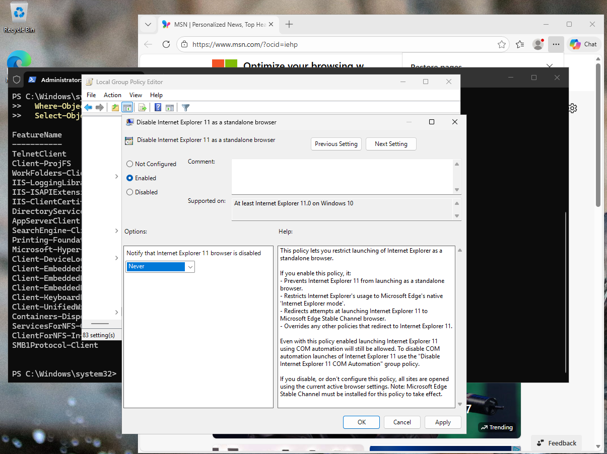
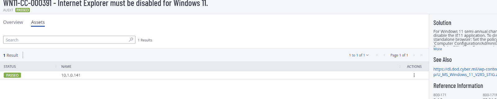

# WN11-CC-000391  
## Internet Explorer Must Be Disabled for Windows 11

**STIG ID:** WN11-CC-000391  
**Severity:** High  
**System:** Windows 11  
**Asset:** notengo  
**Assessment Tool:** Tenable / STIG Viewer  
**Assessment Date:** 02/07/2026  
**Analyst:** Maury Nickelson  

---

## Table of Contents

- [Skills Demonstrated](#skills-demonstrated)
- [Control Objective](#control-objective)
- [Security Risk](#security-risk)
- [Technical Background](#technical-background)
- [Phase 1 — Detection (Baseline Scan)](#phase-1--detection-baseline-scan)
- [Phase 2 — Validation & Analysis](#phase-2--validation--analysis)
- [Phase 3 — Remediation](#phase-3--remediation)
- [Phase 4 — Post-Remediation Validation](#phase-4--post-remediation-validation)
- [Evidence](#evidence)
- [NIST 800-53 Mapping](#nist-800-53-mapping)
- [Compliance & Security Impact](#compliance--security-impact)

---

## Skills Demonstrated

- High-severity vulnerability remediation and validation  
- Legacy software risk assessment and attack surface analysis  
- Windows Optional Feature enumeration via PowerShell  
- File-system artifact inspection and residual binary analysis  
- Execution testing to confirm true-positive findings  
- Group Policy security control enforcement and validation  
- Endpoint hardening and secure configuration management  
- Vulnerability scanner result validation and root cause analysis  
- Windows security baseline alignment (STIG compliance)  
- Security documentation and audit evidence collection  

---

## Control Objective

Ensure Internet Explorer 11 is fully disabled and cannot operate as a standalone browser.

This control enforces system-level restrictions to prevent execution of deprecated browser components that may introduce exploitable vulnerabilities.

---

## Security Risk

Internet Explorer is deprecated and no longer receives full security support.

If enabled, it introduces:

- Legacy browser engine exposure  
- ActiveX control vulnerabilities  
- Outdated scripting components  
- Remote code execution risk  
- Credential theft vectors  
- Web-based malware compromise  

Severity: **High**

---

## Technical Background

Internet Explorer may persist in Windows through:

- Windows Optional Features  
- Residual installation directories  
- Legacy executable files  

Primary validation command:

```powershell
Get-WindowsOptionalFeature -Online -FeatureName Internet-Explorer-Optional-amd64
```

File-system validation:

```powershell
Test-Path "C:\Program Files\Internet Explorer\iexplore.exe"
Test-Path "C:\Program Files (x86)\Internet Explorer\iexplore.exe"
```

Execution test:

```powershell
Start-Process "C:\Program Files\Internet Explorer\iexplore.exe"
```

---

# Phase 1 — Detection (Baseline Scan)

Initial Tenable STIG audit marked this control as **Failed**.

### Baseline Audit Evidence



Scanner indicated Internet Explorer remained enabled or operational.

---

# Phase 2 — Validation & Analysis

## Optional Feature Enumeration

```powershell
Get-WindowsOptionalFeature -Online -FeatureName Internet-Explorer-Optional-amd64
```

### Evidence


Result:

- No feature value returned  
- Suggested IE feature not actively enabled  

Further validation required.

---

## File-System Validation

```powershell
Test-Path "C:\Program Files\Internet Explorer\iexplore.exe"
Test-Path "C:\Program Files (x86)\Internet Explorer\iexplore.exe"
```

### Evidence



Result:

- Internet Explorer executable still present  

Residual binaries may cause scanner findings.

---

## Execution Test (True-Positive Confirmation)

```powershell
Start-Process "C:\Program Files\Internet Explorer\iexplore.exe"
```

### Evidence



Result:

- Internet Explorer successfully launched  

Confirmed **true positive** — IE remained operational.

---

# Phase 3 — Remediation

Due to high severity risk, remediation was required.

Applied Group Policy:

**Disable Internet Explorer 11 as a standalone browser**

Refreshed policy:

```powershell
gpupdate /force
```

This prevented IE from launching independently.

---

# Phase 4 — Post-Remediation Validation

Validated Group Policy enforcement:

```powershell
gpresult /h gp_report.html
```

### Group Policy Enforcement Evidence



Confirmed policy successfully applied.

Re-tested execution — IE could no longer launch.

Tenable re-scan confirmed compliance.

### Post-Remediation Audit Evidence



---

# Evidence

Artifacts stored in `/evidence`:

- `WN11-CC-000391_Baseline_Failed_Audit.png`
- `WN11-CC-000391_OptionalFeature_Enumeration.png`
- `WN11-CC-000391_FileSystem_Residual_Binaries.png`
- `WN11-CC-000391_Execution_Test_IE_Launch.png`
- `WN11-CC-000391_GroupPolicy_Enforcement.png`
- `WN11-CC-000391_Post_Remediation_Passed_Audit.png`

---

# NIST 800-53 Mapping

| NIST Control | Control Name | Relevance |
|--------------|-------------|-----------|
| CM-7 | Least Functionality | Disables unnecessary legacy functionality |
| CM-6 | Configuration Settings | Enforces secure system configuration |
| SI-2 | Flaw Remediation | Addresses vulnerable legacy components |
| SC-7 | Boundary Protection | Reduces web-based exploitation vectors |

---

# Compliance & Security Impact

This remediation:

- Eliminated deprecated browser execution capability  
- Reduced exposure to legacy web-based exploits  
- Removed ActiveX-related attack surface  
- Strengthened endpoint hardening posture  
- Demonstrated structured high-severity vulnerability management lifecycle  

This control significantly improved system security posture by removing legacy attack vectors from the operating environment.
