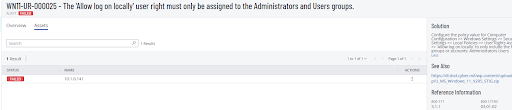

# WN11-UR-000025  
## Allow log on locally must only be assigned to Administrators and Users

**STIG ID:** WN11-UR-000025  
**Severity:** Medium  
**System:** Windows 11 Pro Build 26200  
**Host:** notengo  
**Assessment Tool:** Tenable Vulnerability Management  
**Assessment Date:** 04 Feb 2026  
**Analyst:** Maury Nickelson  

---

## Skills Demonstrated

- Windows 11 STIG remediation  
- Vulnerability validation (true positive confirmation)  
- Security Configuration Editor (`secedit`) auditing  
- Security template creation and enforcement  
- Group Policy troubleshooting (policy override detection)  
- Tenable vulnerability management workflow  
- Compliance validation via re-scan  
- NIST 800-53 control alignment documentation  

---

## Control Objective

Restrict interactive logon rights (`SeInteractiveLogonRight`) to only:

- Administrators  
- Users  

This prevents unauthorized accounts or groups from logging on locally to the system and enforces least privilege.

---

## Security Risk

If additional accounts are granted interactive logon rights, risk increases for:

- Unauthorized local access  
- Privilege escalation  
- Persistence  
- Lateral movement staging  

This control reduces the attack surface and strengthens access enforcement.

---

# Phase 1 — Detection (Baseline Scan)

Initial Tenable audit identified the system as **Non-Compliant**.

### Baseline Tenable Audit Status



Full baseline report:

- [Baseline Scan Report (PDF)](evidence/baseline_scan.pdf)

---

# Phase 2 — Validation & Analysis

Manual validation was performed using:

```powershell
secedit /export /cfg C:\temp\secpol.cfg
Select-String "SeInteractiveLogonRight" C:\temp\secpol.cfg
```

### Validation Result (Pre-Remediation)

The following accounts/groups had interactive logon rights:

- Administrators  
- Users  
- DisabledGuest01  
- Backup Operators  

This confirmed the Tenable finding was a **true positive**.

---

# Phase 3 — Remediation

## Step 1 — Create Security Template

```powershell
@"
[Unicode]
Unicode=yes
[Version]
signature="$CHICAGO$"
Revision=1
[Privilege Rights]
SeInteractiveLogonRight = *S-1-5-32-544,*S-1-5-32-545
"@ | Set-Content -Path "C:\temp\WN11-UR-000025.inf" -Encoding Unicode
```

## Step 2 — Apply Template

```powershell
secedit /configure /db C:\temp\secedit.sdb /cfg C:\temp\WN11-UR-000025.inf /areas USER_RIGHTS
gpupdate /force
```

### Issue Encountered

The setting did not update after applying the template.

**Root Cause:**

Local Group Policy was enforcing the user right and overriding local security template changes.

---

## Final Remediation (Policy-Level Enforcement)

Modified setting via:

Computer Configuration →  
Windows Settings →  
Security Settings →  
Local Policies →  
User Rights Assignment →  
Allow log on locally  

Configured to include only:

- Administrators  
- Users  

Remediation required enforcement at the policy level due to baseline inheritance.

---

# Phase 4 — Post-Remediation Validation

Re-exported configuration:

```powershell
secedit /export /cfg C:\temp\secpol.cfg
Select-String "SeInteractiveLogonRight" C:\temp\secpol.cfg
```

Re-ran Tenable scan.

### Post-Remediation Audit Status


Full post-remediation report:

- [Post-Remediation Scan Report (PDF)](evidence/post_remediation_scan.pdf)

---

## Tenable Scan Summary (Post-Remediation)

- Host: notengo  
- OS: Windows 11 25H2  
- Scan Date: 05 Feb 2026  
- Critical: 0  
- High: 1  
- Medium: 4  
- Low: 0  
- Informational: 94  
- Total Findings: 99  

Control WN11-UR-000025 passed compliance validation.

---

# Evidence

- Baseline audit screenshot: `initial_scan.png`  
- Post-remediation audit screenshot: `post_remediation_passed.png`  
- [Baseline Scan Report (PDF)](evidence/baseline_scan.pdf)  
- [Post-Remediation Scan Report (PDF)](evidence/post_remediation_scan.pdf)

---

# NIST 800-53 Mapping

| NIST Control | Control Name | Relevance |
|--------------|-------------|-----------|
| AC-2 | Account Management | Ensures only authorized accounts are assigned logon rights |
| AC-3 | Access Enforcement | Enforces system-level access control restrictions |
| AC-5 | Separation of Duties | Prevents inappropriate privilege overlap |
| AC-6 | Least Privilege | Restricts interactive access to required groups only |
| IA-2 | Identification & Authentication | Supports controlled interactive session authentication |
